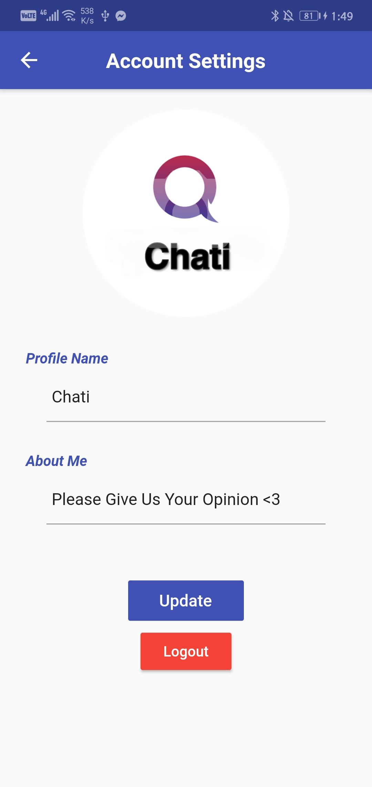

  𝗖𝗛𝗔𝗧𝗜 A fully functional chat application developed by me  
Using 𝗙𝗹𝘂𝘁𝘁𝗲𝗿 and 𝗙𝗶𝗿𝗲𝗯𝗮𝘀𝗲 as a backend  
it has the following features :   
- You can send images from your gallery  
- You can send Stickers (GIF)  
- Sign in with Google account  
- Customize your profile (Change profile picture & About)  
- Search for friends by name  
  

## Sign in with Google   

## HomePage   

## Search for friends  

## Customize your profile  

### Download link
https://www.mediafire.com/file/41b6apjxw243e7l/Chati.apk/file

